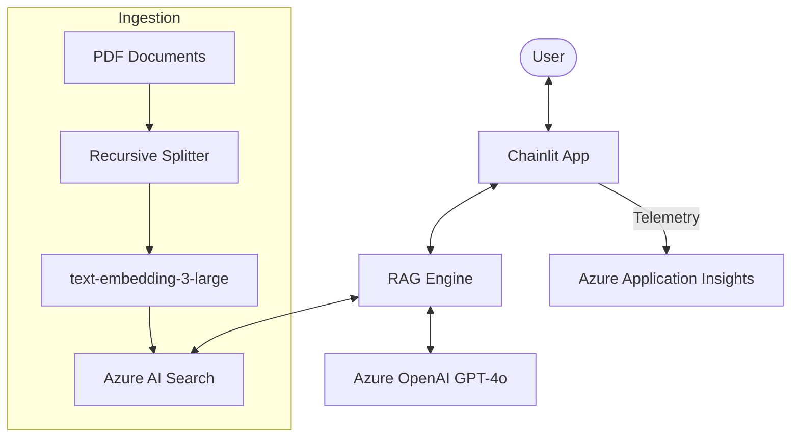

# 🐉 Fuyu Enterprise RAG
> **Enterprise-grade RAG System with Azure AI Search, OpenAI, and Observability.**


## 📋 Overview
Fuyu Enterprise RAG is a sophisticated Retrieval-Augmented Generation (RAG) system designed for enterprise-scale knowledge management. It leverages Microsoft Azure's cloud ecosystem to provide a secure, scalable, and observable AI assistant expert in MLOps and Azure services.

### Key Pillars:
- **🔍 Precision Retrieval**: Hybrid Search (Semantic + Keyword) powered by Azure AI Search.
- **🧠 Expert Reasoning**: Optimized Azure OpenAI (GPT-4) with precision-engineered system prompts.
- **⚖️ Real-time Audit**: Integrated evaluation engine that scores every response for Faithfulness and Relevance.
- **🛰️ Full Observability**: End-to-end monitoring using Azure Monitor (Application Insights) and OpenTelemetry.
- **🏗️ Infrastructure as Code**: Seamless deployment using Azure Bicep.

---

## 🏗️ Architecture


---

## 🛠️ Tech Stack
- **Framework**: [Chainlit](https://chainlit.io/) (UI/UX)
- **Orchestration**: [Python](https://www.python.org/)
- **Large Language Models**: Azure OpenAI (GPT-4o)
- **Vector Database**: Azure AI Search
- **Observability**: Azure Monitor / Application Insights
- **IaC**: Azure Bicep

---

## 🚀 Getting Started

### 1. Prerequisites
- Python 3.10+
- Azure Subscription (Azure OpenAI & AI Search resources)

### 2. Environment Setup
Clone the repository and create a `.env` file based on the following template:
```env
AZURE_OPENAI_ENDPOINT=...
AZURE_OPENAI_KEY=...
AZURE_SEARCH_ENDPOINT=...
AZURE_SEARCH_KEY=...
APPLICATIONINSIGHTS_CONNECTION_STRING=...
```

### 3. Installation
```bash
pip install -r requirements.txt
```

### 4. Data Ingestion
Populate your `data/` folder with PDFs and run:
```bash
python ingest_data.py
```

### 5. Launch
```bash
chainlit run app.py
```

---

## 📊 Evaluation & Quality Control
The system includes a dedicated `evaluator.py` that utilizes an LLM-as-a-judge pattern to audit responses:
- **Faithfulness**: Ensures the answer is derived strictly from the retrieved context.
- **Relevance**: Measures how well the answer addresses the user's query.

Run the benchmarks:
```bash
python benchmark.py
```

---

## 📄 License
This project is licensed under the MIT License - see the [LICENSE](LICENSE) file for details.

---
*Created by [Wladimir Cabascango] - [LinkedIn](https://www.linkedin.com/in/wladimir-cabascango-data/)*
